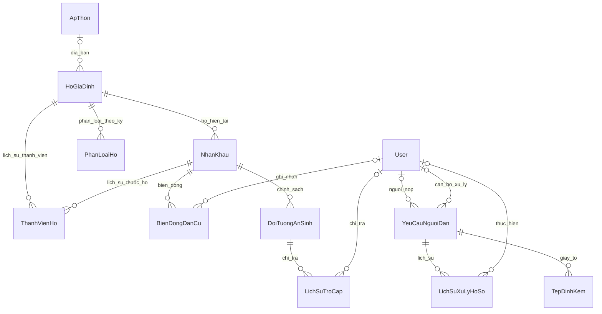

# Mô hình entity Tân An

## Phạm vi

Bộ model gồm 11 entity nghiệp vụ: 6 entity hiện có được mở rộng và 5 entity mới.
Áp dụng cách tách cấu hình EF Core từ dự án tham khảo TrucBTP. Không sao chép nghiệp vụ LGSP,
không thay đổi hệ thống phân quyền, không yêu cầu Redis/S3/Elasticsearch.

| Nhóm | Entity |
|---|---|
| Dân cư | ApThon, HoGiaDinh, NhanKhau, ThanhVienHo, BienDongDanCu |
| An sinh | PhanLoaiHo, DoiTuongAnSinh, LichSuTroCap |
| Hồ sơ | YeuCauNguoiDan, LichSuXuLyHoSo, TepDinhKem |

## Sơ đồ



## Quy ước

- Id/khóa ngoại dùng Guid. DateOnly dùng cho giai đoạn thành viên hộ và phân loại hộ;
  DateTime dùng cho thời điểm thao tác. Các trường mới mặc định thời gian UTC.
- 5 entity mới kế thừa BaseEntity: Id, NgayTao, NguoiTaoId, NgaySua, NguoiSuaId.
  Đây là metadata; service phải điền người thực hiện/ngày sửa khi lưu. Chưa có cơ chế tự động audit.
  Các entity cũ giữ cấu trúc thời gian hiện có để giảm thay đổi ngoài phạm vi.
- MaSoHo, MaYeuCau và mã ấp/thôn là duy nhất.
- CCCD không rỗng là duy nhất. Chuỗi rỗng biểu thị chưa có CCCD, cho phép nhiều người.
  Service phải chuẩn hóa khoảng trắng và kiểm tra định dạng trước khi lưu.
- Thành viên có DenNgay = null là giai đoạn đang mở: tối đa một giai đoạn/người,
  tối đa một chủ hộ đang mở/hộ. Database không tự đảm bảo mỗi hộ luôn có chủ hộ.
- Kiểm tra DenNgay >= TuNgay; mức trợ cấp không âm; số tiền chi trả phải dương;
  dung lượng tệp không âm. Service còn phải kiểm tra chồng lấn các giai đoạn đã đóng.
- Tiền dùng decimal, precision (18,2) với PostgreSQL. SQLite không thực thi giới hạn
  độ dài/precision như PostgreSQL; cần validation ở tầng nghiệp vụ.
- Các quan hệ nghiệp vụ dùng DeleteBehavior.Restrict, tránh mất lịch sử khi xóa cha.
- Tháng chi trả giữ ThangNam (MM/yyyy) để tương thích service hiện tại. Cho phép nhiều
  đợt chi trong tháng; chống trùng giao dịch cần thiết kế ở nghiệp vụ chi trả.

## Tương thích và phần cần nối tiếp

Đây là thay đổi model/schema, chưa triển khai màn hình hay quy trình mới.

1. NhanKhau.MaHoGiaDinh và QuanHeVoiChuHo vẫn là nguồn dữ liệu hộ hiện tại cho service cũ.
   ThanhVienHo là bảng lịch sử mới, chưa tự sinh từ các thao tác service hiện có.
   Khi triển khai chuyển hộ/đổi chủ hộ phải cập nhật quan hệ hiện tại và lịch sử trong
   cùng giao dịch, đồng thời backfill lịch sử từ dữ liệu cũ với ngày bắt đầu được xác minh.
2. HoGiaDinh.ApThon/TenChuHo/CCCDChuHo còn giữ cho DTO/UI cũ; ApThonId nullable để có thể
   chuyển dữ liệu theo giai đoạn. Không tự suy đoán liên kết từ tên.
3. CanBoGhiNhan/NguoiChiTra/CanBoXuLy dạng chuỗi vẫn giữ cùng các khóa ngoại mới nullable.
   Service phải điền FK từ phiên đăng nhập thật; không gán người dùng giả.
4. PhanLoaiHo dành cho hộ nghèo/cận nghèo. Các giá trị enum an sinh cũ giữ nguyên mã số
   để không làm đổi ý nghĩa dữ liệu. Cần chuyển phân loại hộ cũ sang bảng mới khi nâng cấp dữ liệu.
5. LichSuXuLyHoSo và TepDinhKem chưa tự được ghi bởi CitizenRequestService.
6. Họ tên/CCCD/liên hệ trên hồ sơ là ảnh chụp thông tin lúc nộp; NguoiNopId nullable
   cho hồ sơ được cán bộ tiếp nhận từ người không có tài khoản.

## Database hiện có

**Không chạy ứng dụng với database cũ trước khi cập nhật schema.** Dự án đã chuyển sang
EF Core Migrations cho PostgreSQL, có InitialDomainModel và factory cho CLI.
Seeder kiểm tra migration còn thiếu thay vì gọi EnsureCreatedAsync. Xem [MIGRATIONS.md](MIGRATIONS.md).
Migration chưa được áp dụng lên database thực; không xóa hoặc chỉnh dữ liệu hiện có.

Để nâng cấp dữ liệu đang dùng: sao lưu, đối chiếu schema thật, lập migration/baseline phù hợp,
kiểm tra CCCD/MaYeuCau trùng trước khi tạo unique index, rồi backfill các liên kết mới.
Không áp dụng một initial migration trực tiếp lên database đã được tạo bằng EnsureCreated.
Để thử model độc lập, dùng công cụ kiểm tra dưới đây (database SQLite trong RAM).

## Kiểm tra

```powershell
dotnet run --project Tools/EntityModelChecks/EntityModelChecks.csproj
```

Công cụ kiểm tra tạo schema SQLite, kiểm chứng unique index, khóa ngoại, ngày lịch sử,
chủ hộ, bảo toàn lịch sử khi xóa, số tiền và sinh DDL PostgreSQL mà không kết nối máy chủ.
Không thay đổi database của ứng dụng. Sinh DDL PostgreSQL không thay thế kiểm thử tích hợp
trên máy chủ PostgreSQL thật.
